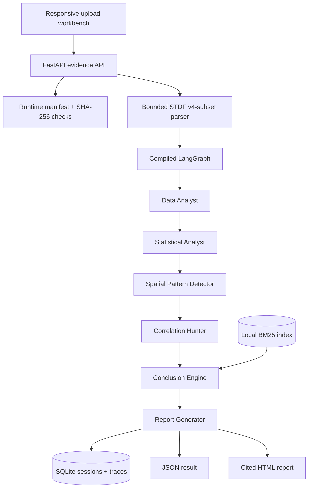

# Architecture: Evaluated Evidence Path

## Decision Boundary

The canonical path is a deterministic six-node LangGraph workflow for
independently generated synthetic STDF. No alternate mocked service path remains.

## Components

## Agent Contracts

| Stage | Input | Output |
|---|---|---|
| Data Analyst | STDF bytes | Hash, lot/wafer IDs, die/yield counts, test catalog |
| Statistical Analyst | Parsed die measurements | Failed/pass means and standardized effect sizes |
| Spatial Pattern Detector | Die coordinates and bins | Edge, stripe, component, entropy, pattern |
| Correlation Hunter | Measurements and pass/fail labels | Pearson correlations ranked by magnitude |
| Conclusion Engine | Four analysis outputs + BM25 hits | Ranked causes, confidence, citations, review flag |
| Report Generator | Selected hypothesis and evidence | Structured report and material-claim citation map |

`backend/rca_evidence/workflow.py` compiles these six nodes with explicit
`START` and `END` edges. Tests inspect the graph node inventory and the ordered
stage traces returned by a real invocation.

## STDF Safety Boundary

`backend/rca_evidence/stdf.py` accepts FAR, MIR, WIR, PIR, PTR, PRR, WRR,
and MRR. Unknown records are counted and skipped; malformed known records fail.
Limits apply to file bytes, total records, dies, tests per die, coordinates,
duplicate identifiers, and finite numeric results.

## Retrieval

`backend/rca_evidence/retrieval.py` builds a real in-memory BM25 index over 30
versioned synthetic documents. Query text comes from observed spatial patterns
and the strongest failed/pass effects. Retrieval results carry document IDs,
scores, root-cause labels, and full text for citation.

## Selection and Runtime Binding

`fusion_balanced_v1` combines normalized rule and retrieval scores at 70/30.
Review is required when confidence is below 0.78, rule and retrieval disagree,
or fewer than three evidence source types support the prediction.

At startup `RuntimeBundle` verifies:

1. model-evaluation SHA-256 against the runtime manifest;
2. corpus SHA-256 against the runtime manifest;
3. runtime policy ID against the confirmed policy ID.

Any mismatch blocks application construction.

## Persistence

SQLite stores one session JSON document plus six normalized stage-trace rows.
The store is local reference persistence, not a high-availability database.

## Deployment

The minimal Chainguard Linux image runs as UID/GID 65532 and installs FastAPI,
LangGraph, Uvicorn, and multipart parsing only. Compose supplies read-only root filesystem, capability
drop, `no-new-privileges`, bounded `/tmp`, and an explicit runtime volume.

The vulnerable mocked service and unused React scaffold were removed. See
[README.md](README.md) for the public evidence dashboard and cleanup rationale.
