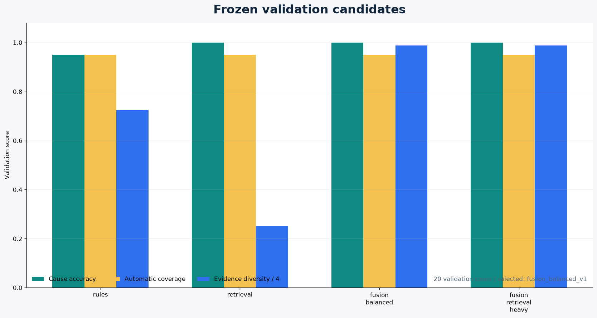
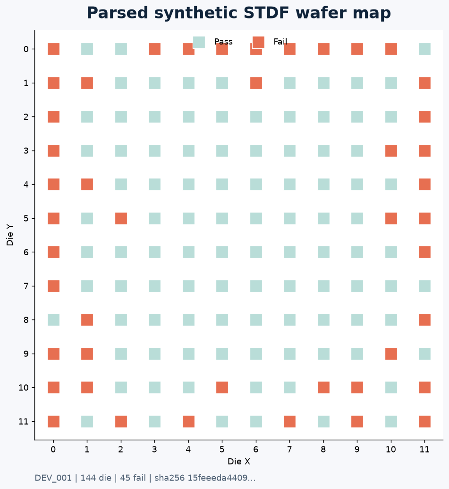
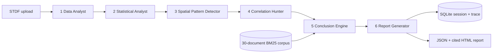

# Evidence-Backed Multi-Agent Test Failure RCA

[](https://github.com/rajendarmuddasani/LangGraph-Multi-Agent-Test-Failure-RCA-Platform/actions/workflows/ci.yml)


[](LICENSE)

A deterministic six-node LangGraph RCA system that parses independently generated STDF,
combines statistical/spatial/correlation evidence with local BM25 retrieval,
ranks a root cause, routes uncertainty to review, persists the complete trace,
and produces a cited report.

> **Evidence boundary:** all accepted quality numbers come from a finite synthetic
> benchmark. They do not establish accuracy, latency, throughput, or production
> readiness on real semiconductor data.

## Evidence Dashboard

| Evidence item | Accepted result | Source |
|---|---:|---|
| Data | 75 STDF files, 10,800 die, 75,600 measurements | [data manifest](data/synthetic_rca_v1/manifest.json) |
| Split | 30 development / 20 validation / 25 confirmation | [data card](docs/DATA_CARD.md) |
| Knowledge corpus | 30 independent synthetic RCA documents | [corpus](data/synthetic_rca_v1/corpus.json) |
| Selected policy | `fusion_balanced_v1` (70% rules / 30% retrieval) | [selection](evidence/selection.json) |
| Confirmation cause accuracy / macro F1 | 100% / 1.000 on 25 cases | [model evaluation](evidence/model_evaluation.json) |
| Accuracy uncertainty | 86.68% to 100% Wilson 95% interval | [policy card](docs/POLICY_CARD.md) |
| Automatic coverage / accepted accuracy | 72% / 100% | [model evaluation](evidence/model_evaluation.json) |
| Engineer-review routing | 28% | [model evaluation](evidence/model_evaluation.json) |
| Groundedness / citation correctness | 100% / 100% | [metric definitions](docs/POLICY_CARD.md) |
| Unsupported citations / hallucination | 0% / 0% | [model evaluation](evidence/model_evaluation.json) |
| Local latency p50 / p95 / p99 | 4.05 / 5.34 / 5.46 ms | [model evaluation](evidence/model_evaluation.json) |
| External LLM calls / API cost | 0 / $0.00 | [runtime manifest](evidence/runtime_manifest.json) |
| Corrupt-input rejection | 4/4 challenges | [model evaluation](evidence/model_evaluation.json) |
| Software validation | 23 tests, 91% coverage, no known runtime CVEs | [local validation](evidence/local_validation.json) |

The confirmation set had no incorrect predictions, so confirmation review recall
has denominator zero. Development and validation errors were routed to review;
real error-capture performance remains unproven.

## What Was Compared



| Candidate | Validation accuracy | Automatic coverage | Evidence sources | Local p95 | Outcome |
|---|---:|---:|---:|---:|---|
| `rules_v1` | 95% | 95% | 2.90 | 4.67 ms | Rejected; one reviewed error |
| `retrieval_v1` | 100% | 95% | 1.00 | 4.57 ms | Rejected; single-source path |
| `fusion_balanced_v1` | 100% | 95% | 3.95 | 4.23 ms | Selected |
| `fusion_retrieval_heavy_v1` | 100% | 95% | 3.95 | 5.17 ms | No improvement; higher p95 |

Candidates were selected only on validation using the frozen objective:

```text
0.40*task_success + 0.25*cause_accuracy
+ 0.20*citation_correctness + 0.15*groundedness
```

All candidate details, including rejected/no-improvement runs, are retained in
[evidence/candidate_results.json](evidence/candidate_results.json).

## Real Binary Ingestion



The bounded parser accepts the STDF v4 records used by this benchmark: FAR, MIR,
WIR, PIR, PTR, PRR, WRR, and MRR. It verifies version/endianness, lifecycle
records, file/record/die/test limits, coordinates, duplicate tests/die, and
finite measurements. Malformed inputs fail closed before analysis.

## Six-Node LangGraph Workflow



Each compiled LangGraph session carries input SHA-256, six node timings, ranked scores, rule/retrieval
agreement, source-type diversity, citations, review status, limitations, and
recommended validation steps.

## Run the Accepted Path

Requires Python 3.10+.

```powershell
python -m pip install -r backend/requirements-evidence.txt
$env:RCA_EVIDENCE_API_KEY = "<choose-a-local-key>"
python -m uvicorn evidence_app:app --app-dir backend --host 127.0.0.1 --port 8088
```

Open `http://127.0.0.1:8088` for the upload workbench. The UI can load the
versioned development sample, display the six-agent trace, and open the persisted
human-readable report.

Authenticated API example:

```powershell
curl.exe -X POST http://127.0.0.1:8088/api/v1/evidence/analyze `
  -H "X-API-Key: $env:RCA_EVIDENCE_API_KEY" `
  -F "file=@data/synthetic_rca_v1/cases/development/DEV_001.stdf"
```

See [deployment details](docs/DEPLOYMENT.md) and the
[security boundary](docs/SECURITY.md).

## Reproduce the Evidence

```powershell
python scripts/validate_evidence.py
python scripts/run_evidence_benchmark.py --stage replay
python -m pytest -q
python -m ruff check backend/rca_evidence backend/evidence_app.py scripts `
  tests/test_evidence_*.py tests/test_stdf_evidence.py `
  tests/test_synthetic_dataset.py tests/test_retrieval_evidence.py `
  --select E,W,F --ignore E501
```

`validate_evidence.py` regenerates all 75 STDF files in a temporary directory and
compares the complete 80-file inventory and hashes. Replay recomputes stable
confirmation metrics for the already-selected champion; it does not reselect.

## Deployment Surface

The minimal Chainguard image in `backend/Dockerfile.evidence` installs four pinned runtime
packages, runs as UID/GID 65532, and exposes the hash-verified policy. Compose
adds a read-only root filesystem, dropped capabilities, `no-new-privileges`,
and one explicit SQLite volume. CI is configured to build the Linux image and
perform health, authentication, analysis, and non-root smoke checks.

The local workstation currently provides a Windows-container engine, so local
Linux image execution is not claimed. Remote container evidence remains pending
until publication triggers CI.

## Repository Map

```text
backend/rca_evidence/           parser, analysis, BM25, workflow, metrics, store
backend/evidence_app.py         accepted FastAPI runtime
backend/evidence_static/        responsive upload/report workbench
data/synthetic_rca_v1/          75 STDF files, split manifests, corpus
evidence/                       claims, candidates, selection, confirmation, assets
scripts/                        generate, evaluate, replay, validate, render assets
tests/                          parser, retrieval, workflow, metrics, API, integrity
docs/                           data, policy, deployment, and security cards
```

## Clean Runtime Surface

The earlier mocked LangChain/OpenAI/Qdrant/PostgreSQL service and unused React
scaffold were removed after audits found 129 Python and seven frontend production
dependency vulnerabilities. The repository now exposes only the evaluated
LangGraph/BM25/SQLite path and its four pinned runtime dependencies.

## Limitations and Promotion Gates

- Synthetic data only; no real-domain accuracy claim.
- Bounded STDF subset, not universal STDF compatibility.
- Local latency benchmark, not a production SLO.
- No accepted 500-RCA/day, uptime, engineering-time, or cost-savings claim.
- No external LLM is used by the selected policy.
- Real deployment requires licensed representative files, expert-adjudicated
  labels, product/tester/lot/time isolation, calibrated uncertainty, parser
  fuzzing, load/soak tests, and operating approval.

The data and code are available under the [MIT License](LICENSE).
